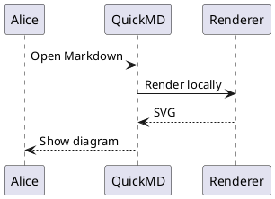
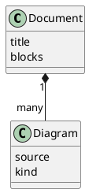
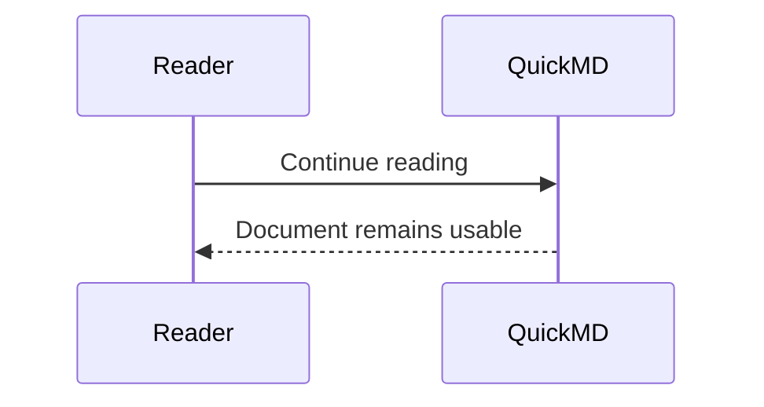

# Offline diagram examples

These diagrams render using libraries bundled with QuickMD. Increase or decrease
text size, resize the window, and click each graphic to inspect its vector preview.

| Input | Renderer | Network needed to render? |
|---|---|---|
| Mermaid | Mermaid | No |
| BPMN XML with layout | bpmn-js | No |
| PlantUML | PlantUML + Viz.js | No |
| SVG | WebKit image rendering | No |

## Mermaid


## PlantUML sequence



## PlantUML classes (Graphviz layout)



## BPMN process

The XML includes BPMN Diagram Interchange layout coordinates.

```bpmn
<?xml version="1.0" encoding="UTF-8"?>
<bpmn:definitions xmlns:bpmn="http://www.omg.org/spec/BPMN/20100524/MODEL"
 xmlns:bpmndi="http://www.omg.org/spec/BPMN/20100524/DI"
 xmlns:dc="http://www.omg.org/spec/DD/20100524/DC"
 xmlns:di="http://www.omg.org/spec/DD/20100524/DI"
 id="Definitions_1" targetNamespace="https://qmd.app/examples">
 <bpmn:process id="Process_1" isExecutable="false">
  <bpmn:startEvent id="Start" name="Request received"/>
  <bpmn:task id="Review" name="Review request"/>
  <bpmn:endEvent id="End" name="Completed"/>
  <bpmn:sequenceFlow id="Flow_1" sourceRef="Start" targetRef="Review"/>
  <bpmn:sequenceFlow id="Flow_2" sourceRef="Review" targetRef="End"/>
 </bpmn:process>
 <bpmndi:BPMNDiagram id="Diagram_1"><bpmndi:BPMNPlane id="Plane_1" bpmnElement="Process_1">
  <bpmndi:BPMNShape id="Start_di" bpmnElement="Start"><dc:Bounds x="80" y="100" width="36" height="36"/></bpmndi:BPMNShape>
  <bpmndi:BPMNShape id="Review_di" bpmnElement="Review"><dc:Bounds x="180" y="78" width="110" height="80"/></bpmndi:BPMNShape>
  <bpmndi:BPMNShape id="End_di" bpmnElement="End"><dc:Bounds x="350" y="100" width="36" height="36"/></bpmndi:BPMNShape>
  <bpmndi:BPMNEdge id="Flow_1_di" bpmnElement="Flow_1"><di:waypoint x="116" y="118"/><di:waypoint x="180" y="118"/></bpmndi:BPMNEdge>
  <bpmndi:BPMNEdge id="Flow_2_di" bpmnElement="Flow_2"><di:waypoint x="290" y="118"/><di:waypoint x="350" y="118"/></bpmndi:BPMNEdge>
 </bpmndi:BPMNPlane></bpmndi:BPMNDiagram>
</bpmn:definitions>
```

## Fenced SVG

```svg
<svg xmlns="http://www.w3.org/2000/svg" width="480" height="160" viewBox="0 0 480 160">
 <rect width="480" height="160" rx="12" fill="#eef4ff"/>
 <g stroke="#2855ad" stroke-width="2" fill="white">
  <rect x="20" y="40" width="150" height="80" rx="8"/>
  <rect x="310" y="40" width="150" height="80" rx="8"/>
  <path d="M170 80h140m-12 -8 12 8-12 8" fill="none"/>
 </g>
 <g fill="#142a50" font-family="sans-serif" font-size="19" text-anchor="middle">
  <text x="95" y="86">SVG source</text><text x="385" y="86">Sharp preview</text>
 </g>
</svg>
```

## Linked BPMN and PlantUML

These linked files should render like their fenced equivalents. Increase and
decrease text size, then click each diagram to open its enlarged preview.


## Linked SVG


## Error handling

The following deliberately invalid diagram should report its syntax error,
while the valid diagram after it still renders.

```plantuml
@startuml
this is not valid PlantUML !!!
@enduml
```


