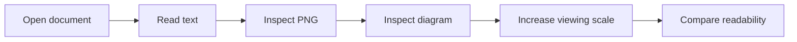

# Image and diagram scaling

This document compares ordinary text, a table, a PNG image, and a Mermaid
diagram at different viewing scales. Keep the window size fixed while changing
the text size or zoom, and compare the readability of each element.

## Text

The document viewer should keep illustrated content readable alongside the
surrounding text. This paragraph provides a reference for **bold text**,
*italic text*, and `inline code` as the viewing scale changes.

Reference sentence: Open the document, review the diagram, and check the result.

## Table

| Element | What to compare | At a larger viewing scale |
|:--------|:----------------|:--------------------------|
| Paragraph | Character size and line wrapping | Is the text larger? |
| Table | Cell text and row height | Does the table scale with the paragraph? |
| PNG image | Image width and text inside the image | Does the image grow too? |
| Mermaid diagram | Node size, labels, and arrows | Are labels still readable beside the paragraph? |

## PNG image

The following local PNG is an existing QuickMD screenshot. Compare the text
inside the image with this sentence before and after increasing the viewing
scale. The image uses standard Markdown without an explicit width or height.

Reference sentence: Open the document, review the diagram, and check the result.

## Mermaid diagram

This diagram contains short labels so their size can be compared with the
surrounding body text. It has no explicit size or theme overrides.

Reference sentence: Open the document, review the diagram, and check the result.

## Manual comparison

1. Open this file in QuickMD at the default viewing scale.
2. Note the PNG width and Mermaid label size relative to the paragraphs.
3. Increase the text size or zoom using the viewer's controls.
4. Compare all four elements again without resizing the window.
5. Return to the original scale and check that the appearance returns to baseline.
6. Click the PNG, check that it fits the window, then press Escape to return.
7. Click the Mermaid diagram, try its zoom controls, then click Done to return.

Record which control you used and whether the PNG and diagram grew along with
the text. If the viewer provides separate text-size and zoom controls, repeat
the comparison for each.

Graphics fit within the document column. Once they reach its width, click to
open the larger preview. Reducing text size should shrink even a fitted graphic.
