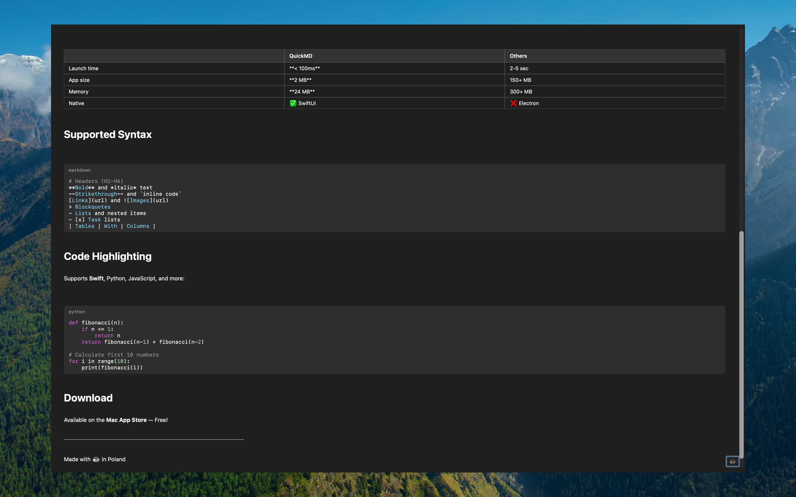
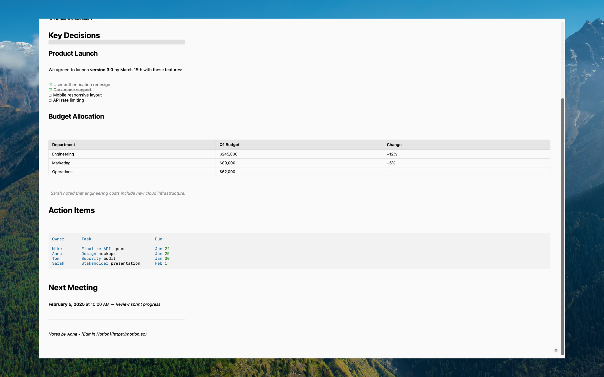
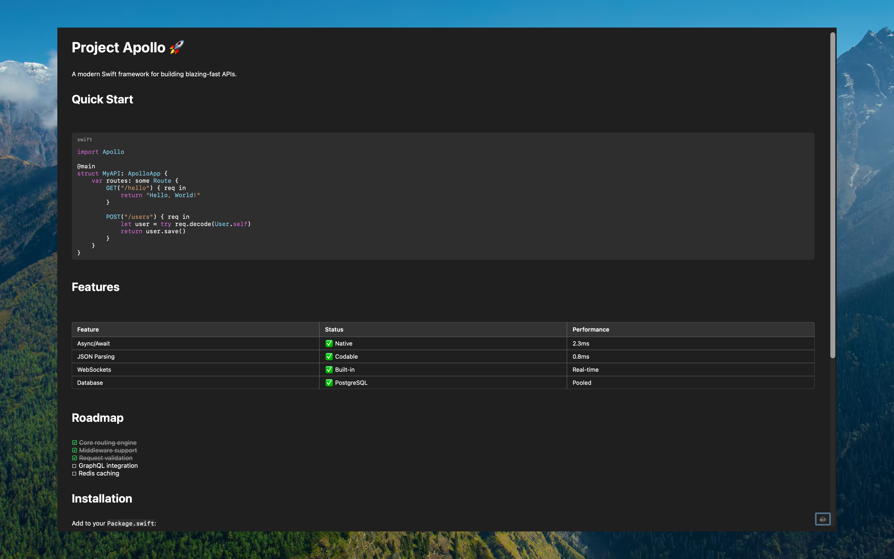
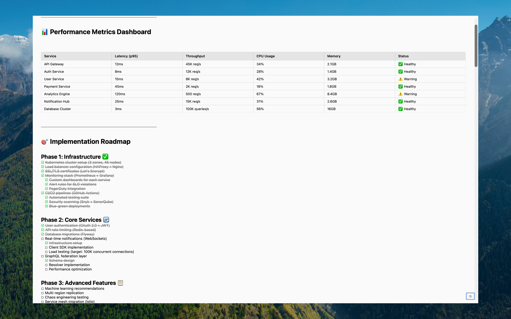
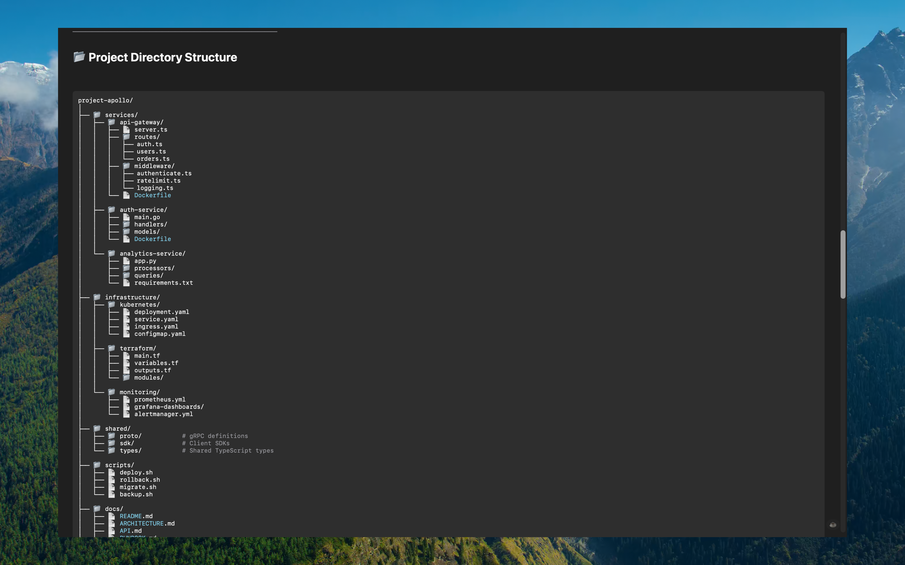

# QuickMD

<div align="center">

**Lightning-fast native macOS Markdown viewer**

[](https://www.apple.com/macos)
[](https://swift.org)
[](LICENSE)

[Features](#features) • [Installation](#installation) • [Usage](#usage) • [Tech Stack](#tech-stack) • [Support](#support)

</div>

---

## Overview

**QuickMD** is the fastest, most elegant Markdown viewer for macOS. Double-click any `.md` file and instantly see beautifully rendered content. No Electron bloat, no loading screens—just pure native macOS performance.

Perfect for developers, writers, students, and anyone who works with Markdown daily. Think of it as the **Preview.app equivalent for Markdown files**.

## Features

### ⚡ **Blazing Fast**
- Opens in milliseconds—no loading screens
- Native SwiftUI app—lightweight (~2MB)
- Instant rendering of even large documents

### 📝 **Complete Markdown Support**
- ✅ Headers, bold, italic, strikethrough
- ✅ Tables with proper column alignment
- ✅ Code blocks with syntax highlighting
- ✅ Task lists with checkboxes (`- [ ]` / `- [x]`)
- ✅ Nested lists (ordered and unordered)
- ✅ Images (local and remote URLs)
- ✅ Links, blockquotes, horizontal rules

### 💻 **Developer-Friendly**
- Syntax highlighting for 10+ languages (Swift, Python, JavaScript, Go, Rust, etc.)
- Perfect for README files and documentation
- Handles AI-generated markdown perfectly
- Dark mode that follows system settings

### 🔒 **Privacy Focused**
- No analytics, no tracking
- Works completely offline (except for remote images)
- Your files stay on your device
- Open source—see exactly what the code does

## Screenshots

<div align="center">

### Dark Mode


### Light Mode


### Syntax Highlighting


### Tables & Lists


### File Tree Example


</div>

## Installation

### Mac App Store (Recommended)

Available soon on the Mac App Store.

### Build from Source

```bash
# Clone the repository
git clone https://github.com/b451c/quickmd.git
cd quickmd/QuickMD

# Open in Xcode
open QuickMD.xcodeproj

# Build and run (⌘R)
```

**Requirements:**
- macOS 14.0 (Sonoma) or later
- Xcode 15.0+
- Swift 5.9+

## Usage

### Set as Default Markdown Viewer

1. Right-click any `.md` file in Finder
2. Select **Get Info** (⌘I)
3. Under **Open with**, select **QuickMD**
4. Click **Change All...**

Now all your Markdown files will open instantly with QuickMD!

### Keyboard Shortcuts

| Shortcut | Action |
|----------|--------|
| `⌘O` | Open file |
| `⌘W` | Close window |
| `⌘⇧D` | Support QuickMD (donation link) |

## Tech Stack

- **Language:** Swift 5.9
- **Framework:** SwiftUI
- **Minimum OS:** macOS 14.0 (Sonoma)
- **Architecture:** Native Apple Silicon + Intel

### Key Components

- Custom Markdown parser with block-level parsing
- Regex-based syntax highlighting for code blocks
- `AsyncImage` for remote image rendering
- Native SwiftUI components for performance

## Project Structure

```
QuickMD/
├── QuickMD/
│   ├── QuickMDApp.swift          # App entry point
│   ├── MarkdownView.swift        # Main view + blocks (tables, code, images)
│   ├── MarkdownRenderer.swift    # Inline markdown parser
│   ├── MarkdownTheme.swift       # Color themes + patterns
│   ├── MarkdownDocument.swift    # Document model
│   └── Assets.xcassets/          # App icon + assets
├── demo-screenshot.md            # Demo file for screenshots
├── AppStore-Metadata.md          # App Store submission guide
└── README.md                     # This file
```

## Development

### Running the App

```bash
# Open in Xcode
open QuickMD/QuickMD.xcodeproj

# Run with ⌘R
```

### Building for Release

1. Select **Product → Archive** in Xcode
2. Choose **Distribute App → App Store Connect**
3. Upload to App Store

See [QuickMD/AppStore-Metadata.md](QuickMD/AppStore-Metadata.md) for detailed submission instructions.

## Support

### Get Help

- 📖 [Documentation](https://github.com/b451c/quickmd/wiki)
- 🐛 [Report a Bug](https://github.com/b451c/quickmd/issues)
- 💡 [Request a Feature](https://github.com/b451c/quickmd/issues)

### Support Development

QuickMD is **free and open source**. If you find it useful, consider supporting development:

[](https://buymeacoffee.com/bsroczynskh)

## Roadmap

- [ ] Table of contents navigation
- [ ] Export to PDF/HTML
- [ ] Custom themes
- [ ] LaTeX math support
- [ ] Mermaid diagram rendering
- [ ] Find & search within document

Have a feature request? [Open an issue!](https://github.com/b451c/quickmd/issues)

## Contributing

Contributions are welcome! Please feel free to submit a Pull Request.

1. Fork the repository
2. Create your feature branch (`git checkout -b feature/amazing-feature`)
3. Commit your changes (`git commit -m 'Add amazing feature'`)
4. Push to the branch (`git push origin feature/amazing-feature`)
5. Open a Pull Request

## License

This project is licensed under the **MIT License** - see the [LICENSE](LICENSE) file for details.

## Privacy

QuickMD respects your privacy. See our [Privacy Policy](PRIVACY.md) for details.

**TL;DR:** No data collection, no analytics, no tracking. Everything runs locally on your device.

---

<div align="center">

**Built with ❤️ using Swift and SwiftUI**

⭐ Star this repo if you find QuickMD useful!

</div>
