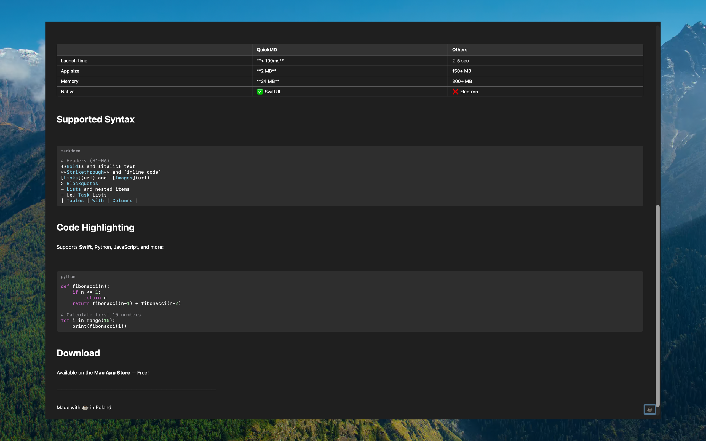
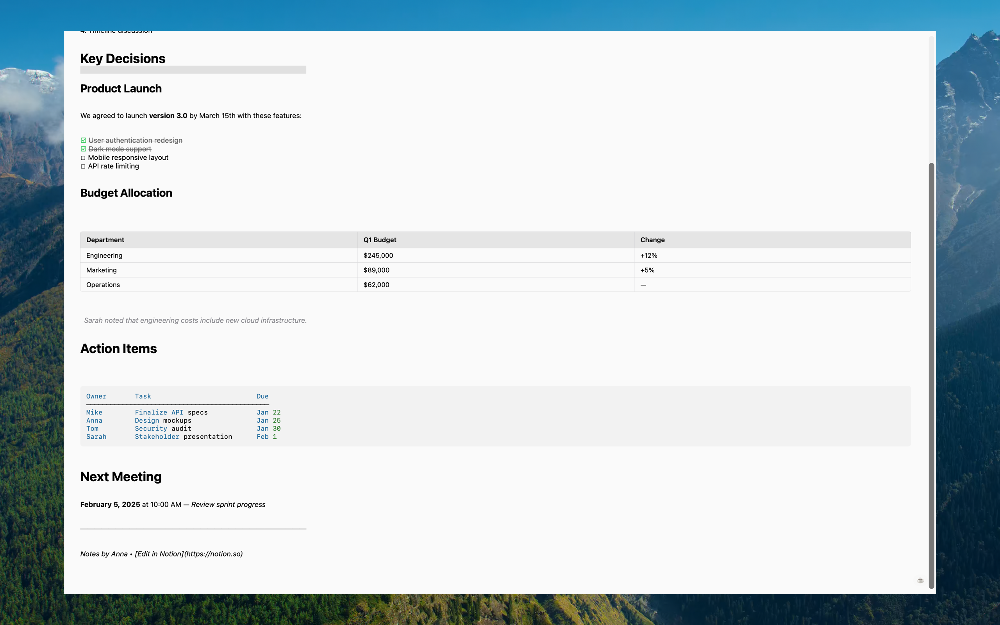
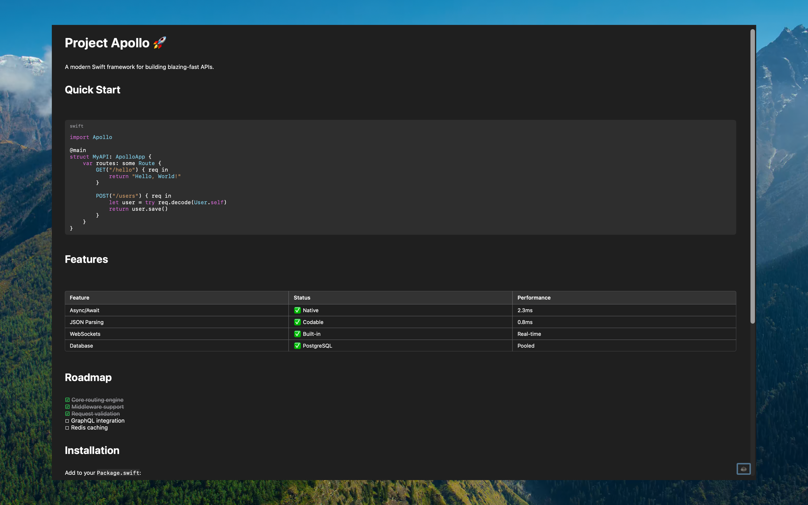
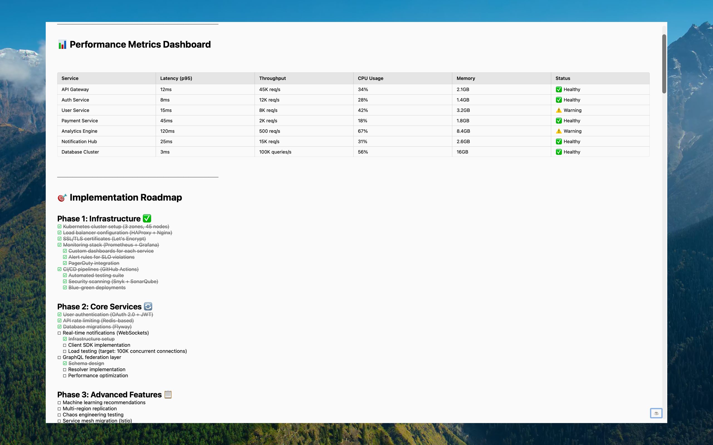
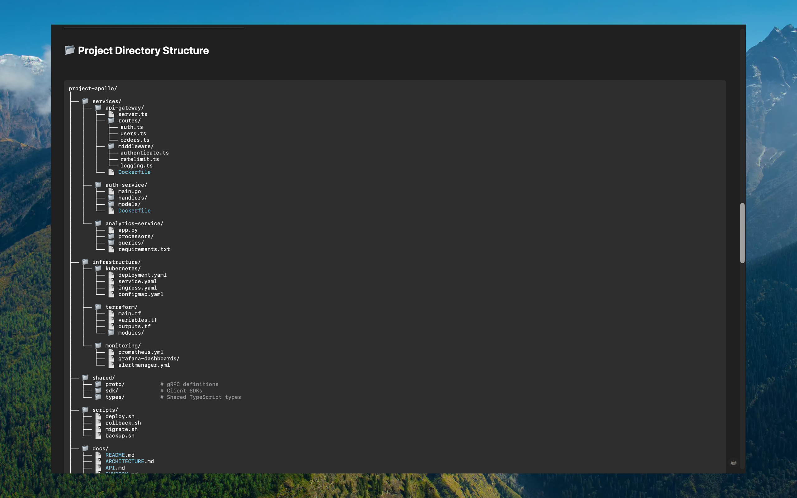
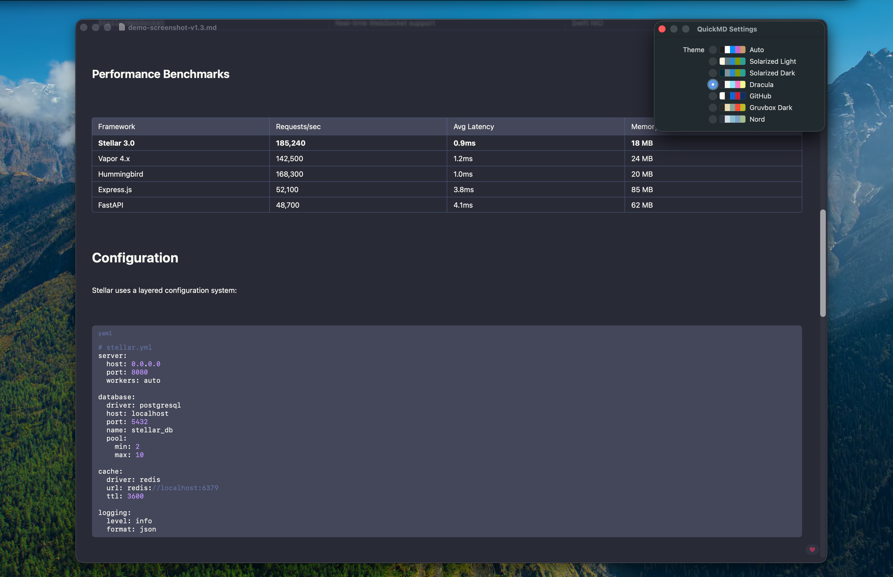
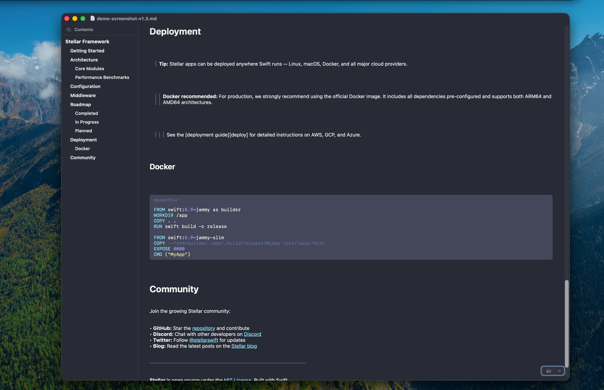

# QuickMD

<div align="center">

**Lightning-fast native macOS Markdown viewer**

[](https://www.apple.com/macos)
[](https://swift.org)
[](LICENSE)

[Features](#features) • [Installation](#installation) • [Usage](#usage) • [Tech Stack](#tech-stack) • [Support](#support)

</div>

---

## Overview

**QuickMD** is the fastest, most elegant Markdown viewer for macOS. Double-click any `.md` file and instantly see beautifully rendered content. No Electron bloat, no loading screens—just pure native macOS performance.

Perfect for developers, writers, students, and anyone who works with Markdown daily. Think of it as the **Preview.app equivalent for Markdown files**.

## Features

### ⚡ **Blazing Fast**
- Opens in milliseconds—no loading screens
- Native SwiftUI app—lightweight
- Instant rendering of even large documents

### 📝 **Complete Markdown Support**
- ✅ Headers, bold, italic, strikethrough
- ✅ Tables with proper column alignment
- ✅ Code blocks with syntax highlighting
- ✅ **LaTeX math** — display math (`$$...$$`) with TeX-quality rendering
- ✅ **Mermaid diagrams** — flowcharts, sequence, pie, class diagrams and more
- ✅ Task lists with checkboxes (`- [ ]` / `- [x]`)
- ✅ Nested lists (ordered and unordered)
- ✅ Images (local and remote URLs)
- ✅ Links (inline, reference-style, autolinks)
- ✅ Nested blockquotes with level indicators
- ✅ Horizontal rules

### 🔍 **Navigation & Search**
- Find in document (`⌘F`) with match count and per-word navigation
- Word-level highlighting across all block types (text, code, tables, blockquotes)
- Table of Contents sidebar (`⌘⇧T`) — auto-generated from headings
- Copy entire document (`⌘⇧C`) or individual sections (hover heading → copy icon)
- Export to PDF (`⌘⇧E`) and Print (`⌘P`)

### 🎨 **Custom Themes**
- 7 built-in themes: Auto, Solarized Light/Dark, Dracula, GitHub, Gruvbox Dark, Nord
- Settings panel (`⌘,`) with color previews
- Theme persists across app restarts

### 💻 **Developer-Friendly**
- Syntax highlighting for 10+ languages (Swift, Python, JavaScript, Go, Rust, etc.)
- Perfect for README files and documentation
- Handles AI-generated markdown perfectly
- Dark mode that follows system settings (or choose a fixed theme)

### 🔒 **Privacy Focused**
- No analytics, no tracking
- Works completely offline (except for remote images)
- Your files stay on your device
- Open source—see exactly what the code does

## Screenshots

<div align="center">

### Dark Mode


### Light Mode


### Syntax Highlighting


### Tables & Lists


### File Tree Example


### Theme Picker & Tables (Dracula)


### Table of Contents & Blockquotes


</div>

## Installation

### Mac App Store (Recommended)

Available on the [Mac App Store](https://apps.apple.com/app/quickmd/id6757681819).

### Homebrew

```bash
brew install --cask quickmd
```

### Build from Source

```bash
# Clone the repository
git clone https://github.com/b451c/quickmd.git
cd quickmd/QuickMD

# Open in Xcode
open QuickMD.xcodeproj

# Build and run (⌘R)
```

**Requirements:**
- macOS 13.0 (Ventura) or later
- Xcode 15.0+
- Swift 5.9+

## Usage

### Set as Default Markdown Viewer

1. Right-click any `.md` file in Finder
2. Select **Get Info** (⌘I)
3. Under **Open with**, select **QuickMD**
4. Click **Change All...**

Now all your Markdown files will open instantly with QuickMD!

### Keyboard Shortcuts

| Shortcut | Action |
|----------|--------|
| `⌘O` | Open file |
| `⌘W` | Close window |
| `⌘F` | Find in document |
| `⌘G` / `⇧⌘G` | Next / previous match |
| `⌘⇧C` | Copy Markdown source |
| `⌘⇧T` | Toggle Table of Contents |
| `⌘⇧E` | Export to PDF |
| `⌘P` | Print |
| `⌘,` | Settings (theme picker) |

## Tech Stack

- **Language:** Swift 5.9
- **Framework:** SwiftUI
- **Minimum OS:** macOS 13.0 (Ventura)
- **Architecture:** Native Apple Silicon + Intel

### Key Components

- Custom Markdown parser with block-level parsing and reference link pre-pass
- Regex-based syntax highlighting for code blocks
- LaTeX math rendering via vendored [SwiftMath](https://github.com/mgriebling/SwiftMath) (Core Graphics, no network)
- Mermaid diagram rendering via bundled [Mermaid.js](https://mermaid.js.org/) (offline, no CDN)
- 7 color themes with `@AppStorage` persistence
- `AsyncImage` for remote image rendering
- Security-Scoped Bookmarks for local image access in sandbox
- Per-block PDF export with multi-page pagination
- Zero external package dependencies — everything is vendored or bundled

## Project Structure

```
QuickMD/
├── QuickMD/
│   ├── QuickMDApp.swift            # App entry point + menu commands
│   ├── MarkdownDocument.swift      # FileDocument model
│   ├── MarkdownView.swift          # Main document view + support buttons
│   ├── MarkdownBlock.swift         # Block type enum
│   ├── MarkdownBlockParser.swift   # Line-by-line block parser
│   ├── MarkdownRenderer.swift      # Inline markdown → AttributedString
│   ├── MarkdownTheme.swift         # 7 color themes, regex patterns
│   ├── MarkdownExport.swift        # PDF export + print support
│   ├── TipJarManager.swift         # StoreKit 2 IAP (App Store only)
│   ├── TipJarView.swift            # Tip Jar UI (App Store only)
│   ├── Views/
│   │   ├── CodeBlockView.swift     # Syntax-highlighted code blocks
│   │   ├── TableBlockView.swift    # Table rendering with alignment
│   │   ├── ImageBlockView.swift    # Local + remote image rendering
│   │   ├── BlockquoteView.swift    # Nested blockquotes
│   │   ├── SearchBar.swift         # Find in document (⌘F)
│   │   ├── TableOfContentsView.swift # ToC sidebar (⌘⇧T)
│   │   └── ThemePickerView.swift   # Theme settings (⌘,)
│   └── Assets.xcassets/            # App icon + assets
├── CHANGELOG.md                    # Version history
└── demo.md                         # Demo file for testing
```

## Development

### Running the App

```bash
# Open in Xcode
open QuickMD/QuickMD.xcodeproj

# Run with ⌘R
```

### Building for Release

**GitHub version** (default — donation links, no Tip Jar):

```bash
xcodebuild -project QuickMD/QuickMD.xcodeproj -scheme QuickMD -configuration Release archive
```

Or simply build in Xcode with `⌘B`.

**App Store version** (Tip Jar IAP):

```bash
xcodebuild -project QuickMD/QuickMD.xcodeproj -scheme QuickMD -configuration Release \
  OTHER_SWIFT_FLAGS="-DAPPSTORE" archive
```

See [QuickMD/AppStore-Metadata.md](QuickMD/AppStore-Metadata.md) for detailed submission instructions.

## Support

### Get Help

- 📖 [Documentation](https://github.com/b451c/quickmd/wiki)
- 🐛 [Report a Bug](https://github.com/b451c/quickmd/issues)
- 💡 [Request a Feature](https://github.com/b451c/quickmd/issues)

### Support Development

QuickMD is **free and open source**. If you find it useful, consider supporting development:

<a href="https://buymeacoffee.com/bsroczynskh" target="_blank"></a>
<a href="https://ko-fi.com/quickmd" target="_blank"></a>

## Roadmap

- [x] Export to PDF (`⌘⇧E`) and Print (`⌘P`)
- [x] Syntax highlighting for code blocks
- [x] Find & search within document (`⌘F`)
- [x] Nested blockquotes with level indicators
- [x] Table of Contents sidebar (`⌘⇧T`)
- [x] Reference-style links (`[text][id]`)
- [x] Custom color themes (7 built-in)
- [x] Copy to clipboard (whole file + sections)
- [x] LaTeX math rendering (`$$...$$`)
- [x] Mermaid diagram rendering (flowcharts, sequence, pie, class, etc.)
- [x] Security-Scoped Bookmarks for local images
- [x] Persistent Table of Contents state
- [x] Inline math (`$...$`)
- [x] Footnotes (`[^id]` references with definitions)
- [x] Homebrew Cask formula
- [ ] Graphical inline math rendering (TeX-quality in paragraph text)
- [ ] Mermaid diagram PDF export (full fidelity)

Have a feature request? [Open an issue!](https://github.com/b451c/quickmd/issues)

## Contributing

Contributions are welcome! Please feel free to submit a Pull Request.

1. Fork the repository
2. Create your feature branch (`git checkout -b feature/amazing-feature`)
3. Commit your changes (`git commit -m 'Add amazing feature'`)
4. Push to the branch (`git push origin feature/amazing-feature`)
5. Open a Pull Request

## License

This project is licensed under the **MIT License** - see the [LICENSE](LICENSE) file for details.

## Privacy

QuickMD respects your privacy. See our [Privacy Policy](PRIVACY.md) for details.

**TL;DR:** No data collection, no analytics, no tracking. Everything runs locally on your device.

---

<div align="center">

**Built with ❤️ using Swift and SwiftUI**

⭐ Star this repo if you find QuickMD useful!

</div>
