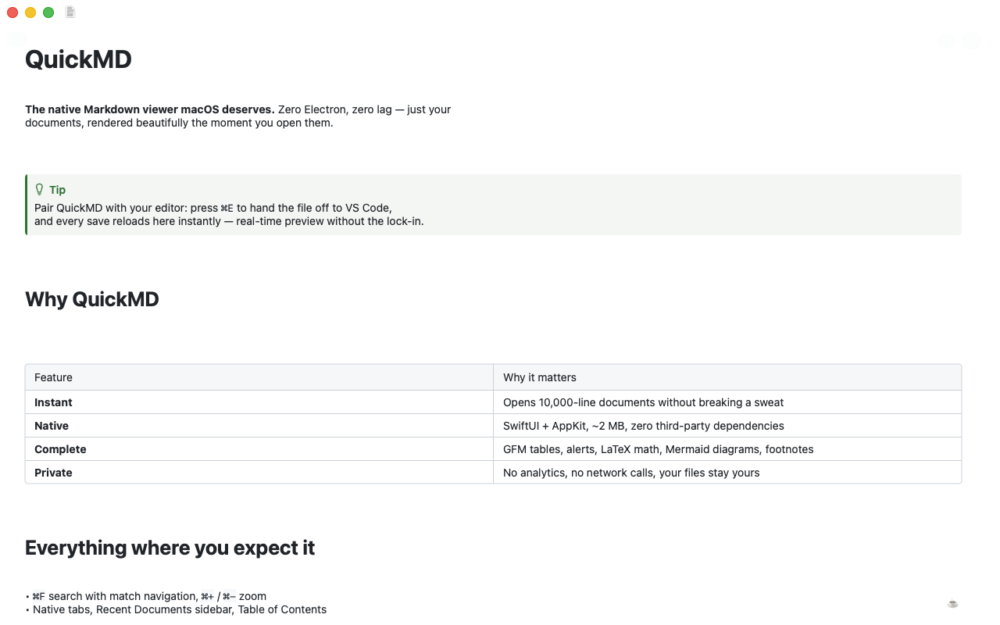
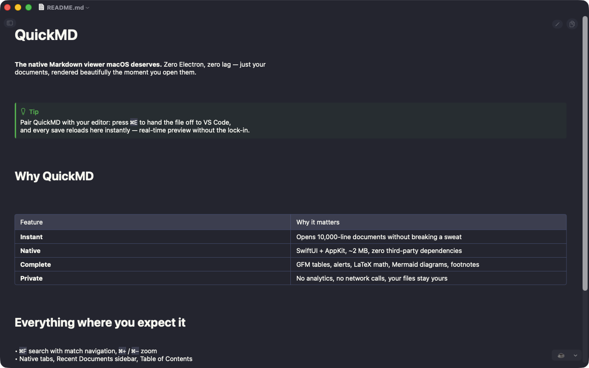
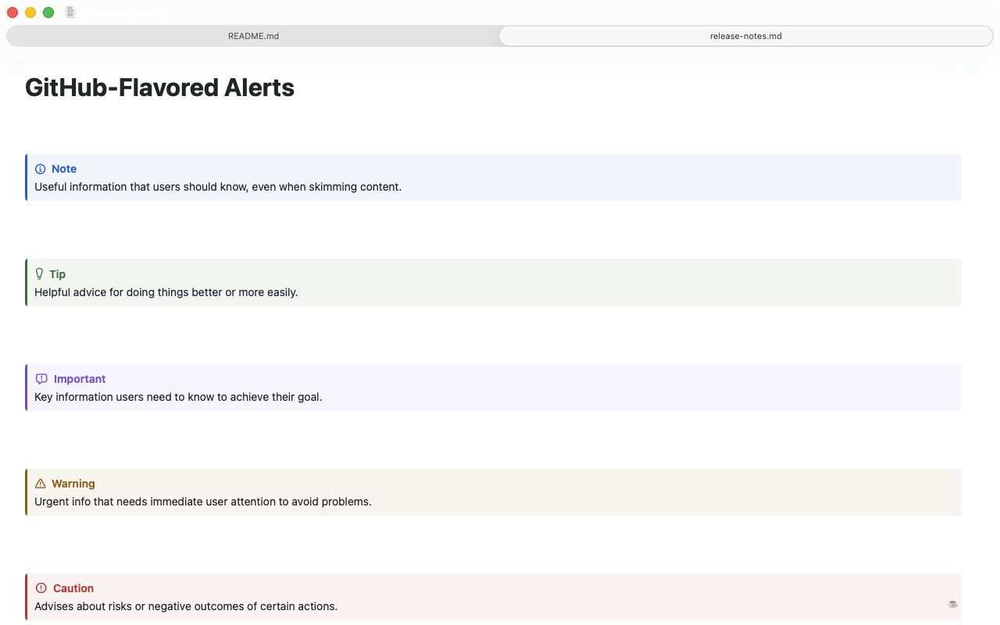
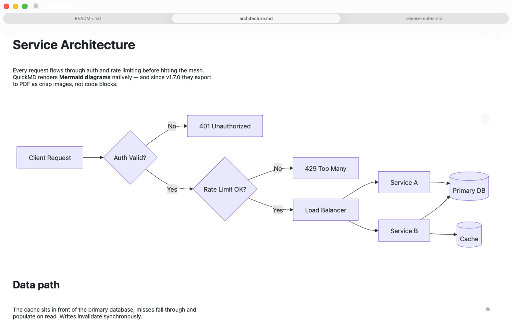
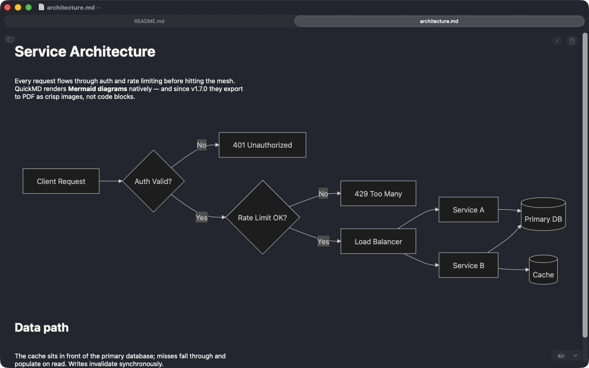
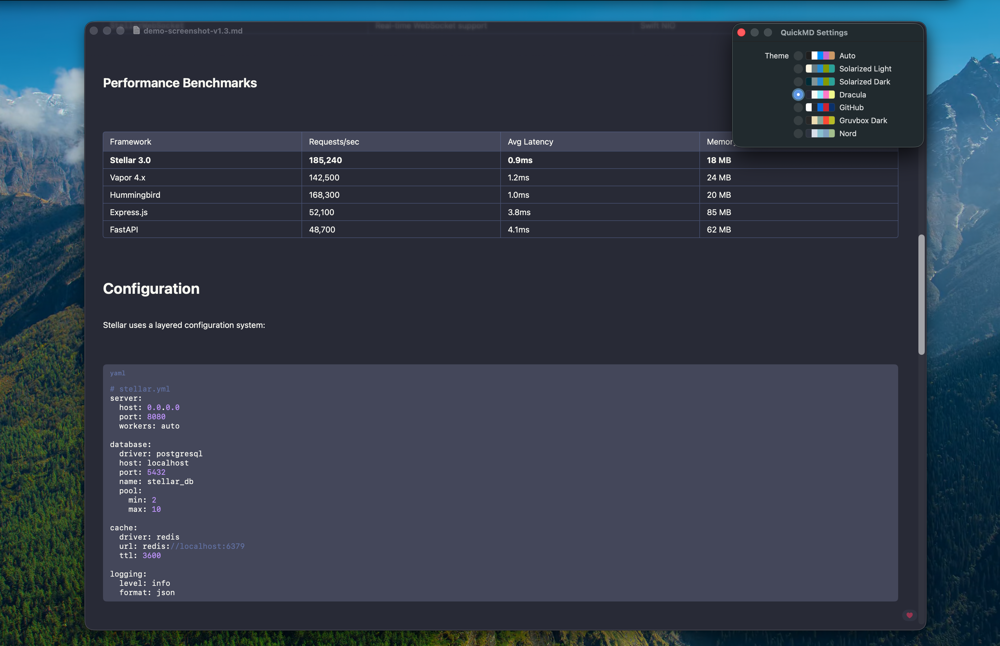
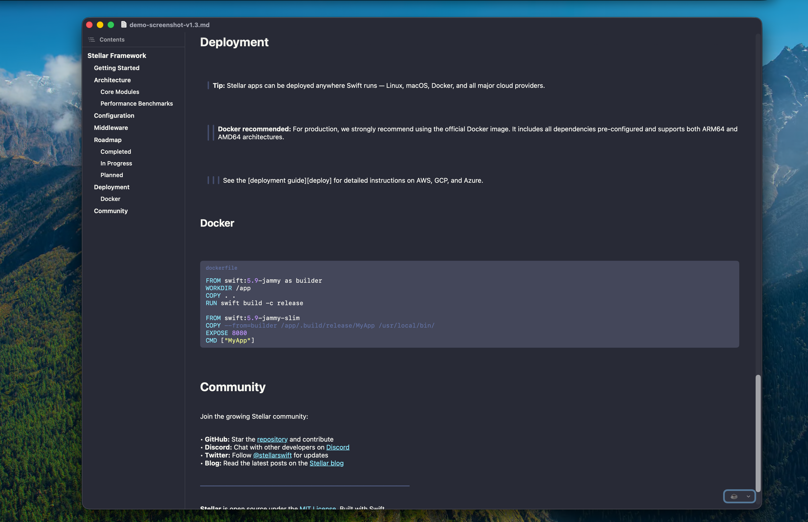

# QuickMD

<div align="center">

**Lightning-fast native macOS Markdown viewer**

[](https://www.apple.com/macos)
[](https://swift.org)
[](https://github.com/b451c/quickmd/actions/workflows/build.yml)
[](LICENSE)

[Features](#features) • [Installation](#installation) • [Usage](#usage) • [Tech Stack](#tech-stack) • [Support](#support)

</div>

---

## Overview

**QuickMD** is the fastest, most elegant Markdown viewer for macOS. Double-click any `.md` file and instantly see beautifully rendered content. No Electron bloat, no loading screens—just pure native macOS performance.

Perfect for developers, writers, students, and anyone who works with Markdown daily. Think of it as the **Preview.app equivalent for Markdown files**.

## Features

### Blazing Fast
- Opens in milliseconds—no loading screens
- Native SwiftUI + AppKit app—lightweight, zero dependencies
- Huge documents (10,000+ lines) open and scroll smoothly, Table of Contents and search jumps land exactly, and QuickMD keeps your place through zoom, theme changes, resizes and auto-reload

### Companion to Your Editor
- **Auto-reload** — the document refreshes the moment your editor saves it. Enable auto-save in VS Code/Cursor/Zed and QuickMD becomes a live preview
- **Open in External Editor (`⌘E`)** — one-click handoff to VS Code, Cursor, Sublime, Zed, Typora, Obsidian and more (auto-detected; configurable in Settings)
- **Copy button on code blocks** — hover and click, like on GitHub

### Complete Markdown Support
- Headers, bold, italic, strikethrough (ATX `#` and setext underline styles)
- **GitHub-flavored alerts** — `[!NOTE]`, `[!TIP]`, `[!IMPORTANT]`, `[!WARNING]`, `[!CAUTION]` render as native callouts in GitHub's palette
- Tables with proper column alignment (headerless `| | |` tables too)
- Code blocks with syntax highlighting
- **LaTeX math** — display (`$$...$$`) and inline (`$...$`) with TeX-quality rendering
- **Mermaid diagrams** — flowcharts, sequence, pie, class diagrams and more, with a pinch-to-zoom viewer
- **Footnotes** — `[^id]` references with definitions at end of document
- **Definition lists** — `Term` followed by `: definition` lines (PHP Markdown Extra / Pandoc `:` syntax); several terms per definition, several definitions per term, wrapped definitions hang under their text
- Task lists with checkboxes (`- [ ]` / `- [x]`)
- Nested lists (ordered and unordered)
- Images (local and remote URLs)
- Links (inline, reference-style, autolinks)
- Nested blockquotes with level indicators
- Horizontal rules
- YAML frontmatter (rendered as a neutral code block)
- Windows (CRLF) and legacy line endings, UTF-16/Latin-1 fallbacks
- CommonMark soft breaks — a single newline inside a paragraph reads as a space; two trailing spaces or a trailing `\` make a hard break

### Navigation & Search
- Zoom the whole document (`⌘+` / `⌘-` / `⌘0`) — per window, everything scales
- Find in document (`⌘F`) with match count and per-word navigation
- Word-level highlighting across all block types (text, code, tables, blockquotes)
- Table of Contents sidebar (`⌘⇧T`) — auto-generated from headings
- Reading mode (`⌘⇧R`) — hides both sidebars and the hover buttons and centres the text in a 720 pt column; `Esc` brings everything back
- Copy entire document (`⌘⇧C`) or individual sections (hover heading → copy icon)
- Export to PDF (`⌘⇧E`) — **vector text** (selectable, searchable) with **rendered Mermaid diagrams** — and Print (`⌘P`)

### Custom Themes & Fonts
- 7 built-in themes: Auto, Solarized Light/Dark, Dracula, GitHub, Gruvbox Dark, Nord
- **User themes from disk** — drop a JSON file into `~/Library/Containers/pl.falami.studio.QuickMD/Data/Library/Application Support/QuickMD/Themes/` (or use the **Import Theme…** button in Settings). Live reload, no restart. See [docs/themes/](docs/themes/) for the schema and examples.
- **Custom font families** — pick any installed font for body text and another for code in Settings → Fonts (JetBrains Mono for code, a serif for reading…). Applies to the document, print and PDF; size and zoom are unaffected. Themes can set their own with `bodyFontFamily` / `codeFontFamily`.
- Settings panel (`⌘,`) with color and font previews
- Theme and fonts persist across app restarts

### Developer-Friendly
- Lightweight syntax highlighting (keywords, strings, comments, numbers, types) that works across common languages — Swift, Python, JavaScript, Go, Rust and more
- Perfect for README files and documentation
- Handles AI-generated markdown perfectly
- Dark mode that follows system settings (or choose a fixed theme)

### Privacy Focused
- No analytics, no tracking
- Works completely offline (except for remote images)
- Your files stay on your device
- Open source—see exactly what the code does

## Screenshots

<div align="center">
<table>
<tr>
<td></td>
<td></td>
</tr>
<tr>
<td align="center"><em>Light Mode (GitHub theme)</em></td>
<td align="center"><em>Dark Mode (Dracula theme)</em></td>
</tr>
<tr>
<td></td>
<td></td>
</tr>
<tr>
<td align="center"><em>GitHub-flavored alerts</em></td>
<td align="center"><em>Mermaid diagrams, rendered natively</em></td>
</tr>
</table>
</div>

<details>
<summary><strong>More screenshots</strong></summary>

| Diagrams in Dark Mode | Theme Picker | Table of Contents |
|:-:|:-:|:-:|
|  |  |  |

</details>

## Installation

### Mac App Store (Recommended)

Available on the [Mac App Store](https://apps.apple.com/app/quickmd/id6757681819).

### Homebrew

```bash
brew tap b451c/quickmd
brew install --cask quickmd
```

### Build from Source

```bash
# Clone the repository
git clone https://github.com/b451c/quickmd.git
cd quickmd/QuickMD

# Open in Xcode
open QuickMD.xcodeproj

# Build and run (⌘R)
```

**Requirements:**
- macOS 13.0 (Ventura) or later
- Xcode 15.0+
- Swift 5.9+

## Usage

### Set as Default Markdown Viewer

1. Right-click any `.md` file in Finder
2. Select **Get Info** (⌘I)
3. Under **Open with**, select **QuickMD**
4. Click **Change All...**

Now all your Markdown files will open instantly with QuickMD!

### Keyboard Shortcuts

| Shortcut | Action |
|----------|--------|
| `⌘O` | Open file |
| `⌘W` | Close tab (or window if last tab) |
| `⌘E` | Open in External Editor |
| `⌘F` | Find in document |
| `⌘G` / `⇧⌘G` | Next / previous match |
| `⌘⇧C` | Copy Markdown source |
| `⌘⇧T` | Toggle Table of Contents |
| `⌘⇧D` | Toggle Recent Documents sidebar |
| `⌘⇧R` | Reading mode (distraction-free) |
| `⌃⇥` / `⌃⇧⇥` | Switch between tabs |
| `⌘⇧E` | Export to PDF |
| `⌘P` | Print |
| `⌘,` | Settings (themes, fonts, external editor) |
| `⌘+` / `⌘-` / `⌘0` | Zoom in / out / actual size |

## Tech Stack

- **Language:** Swift 5.9
- **Framework:** SwiftUI + AppKit
- **Minimum OS:** macOS 13.0 (Ventura)
- **Architecture:** Native Apple Silicon + Intel

### Key Components

- Custom Markdown parser with block-level parsing, YAML frontmatter and reference link pre-pass
- Native `NSTextView` text pipeline hosted in a virtualized `NSTableView` — native selection, native links, exact row heights measured off the main thread, no SwiftUI text bottlenecks on huge documents
- Per-document file watcher (`DispatchSource`) powering auto-reload, including atomic editor saves
- Regex-based syntax highlighting for code blocks (computed off the main thread)
- LaTeX math rendering via vendored [SwiftMath](https://github.com/mgriebling/SwiftMath) (Core Graphics, no network); inline math as native text attachments
- Mermaid diagram rendering via bundled [Mermaid.js](https://mermaid.js.org/) (offline, no CDN), with snapshot caching and a zoom viewer
- 7 built-in themes + user themes from disk, with `@AppStorage` persistence; document font families resolved through `NSFontDescriptor` with a small cache and system-font fallback
- `AsyncImage` for remote image rendering
- Security-Scoped Bookmarks for local image access in sandbox
- Per-block **vector PDF export** — selectable text, embedded fonts, Mermaid diagrams as images, multi-page pagination
- Zero external package dependencies — everything is vendored or bundled
- Unit test suite (186 tests) + GitHub Actions CI building every flavor on each push

## Project Structure

```
QuickMD/
├── QuickMD/
│   ├── QuickMDApp.swift            # App entry point + menu commands
│   ├── MarkdownDocument.swift      # FileDocument model (encoding + line-ending normalization)
│   ├── MarkdownView.swift          # Main document view (parse + measure pipeline, overlays)
│   ├── MarkdownBlock.swift         # Block type enum
│   ├── MarkdownBlockParser.swift   # Line-by-line block parser (+ YAML frontmatter)
│   ├── MarkdownRenderer.swift      # Inline markdown → AttributedString (SwiftUI + AppKit scopes)
│   ├── MarkdownTheme.swift         # Built-in themes (+ font family merging)
│   ├── DocumentFonts.swift         # Body/code font families: resolution, cache, Settings + theme merge
│   ├── MarkdownExport.swift        # PDF export + print support
│   ├── DocumentSearch.swift        # Find-in-document match engine
│   ├── SectionExtractor.swift      # "Copy section" boundaries from parser source lines
│   ├── InlineMathSegmenter.swift   # $...$ segmentation
│   ├── BlockHeightMeasurer.swift   # Off-main exact block heights (TextKit) + BlockLayout metrics
│   ├── FileWatchManager.swift      # Auto-reload file watcher (DispatchSource)
│   ├── ExternalEditorManager.swift # ⌘E editor detection + launch
│   ├── WindowTabbing.swift         # Native macOS tab merging + window size memory
│   ├── MermaidPDFRenderer.swift    # Mermaid → image rendering for PDF export
│   ├── CustomThemeStore.swift      # User themes from disk (live reload + validation)
│   ├── RecentDocumentsStore.swift  # Recent documents tracking
│   ├── TipJarManager.swift         # StoreKit 2 IAP (App Store only)
│   ├── TipJarView.swift            # Tip Jar UI (App Store only)
│   ├── SandboxAccessManager.swift  # Security-scoped bookmarks
│   ├── SwiftMath/                  # Vendored math rendering (Core Graphics)
│   ├── Resources/
│   │   ├── mermaid.min.js          # Bundled Mermaid.js
│   │   └── mermaid-template.html   # HTML template for diagrams
│   ├── Views/
│   │   ├── VirtualBlockList.swift  # NSScrollView + NSTableView host: one row per block, exact heights
│   │   ├── TextBlockView.swift     # NSTextView-backed text blocks (native selection, inline math)
│   │   ├── CodeBlockView.swift     # NSTextView-backed code blocks (+ copy button)
│   │   ├── MathBlockView.swift     # LaTeX display math ($$...$$)
│   │   ├── MermaidBlockView.swift  # Mermaid diagrams (WKWebView + zoom + snapshot cache)
│   │   ├── TableBlockView.swift    # Table rendering with alignment
│   │   ├── ImageBlockView.swift    # Local + remote image rendering
│   │   ├── BlockquoteView.swift    # Nested blockquotes
│   │   ├── AlertBlockView.swift    # GitHub-flavored alerts ([!NOTE], [!TIP], ...)
│   │   ├── ChromeButtons.swift     # Heading copy, source copy, edit, zoom, support pills
│   │   ├── ChromeHoverState.swift  # Hover-cluster state for the top-right pills
│   │   ├── SearchBar.swift         # Find in document (⌘F)
│   │   ├── TableOfContentsView.swift # ToC sidebar (⌘⇧T)
│   │   ├── RecentDocumentsSidebar.swift # Recent docs sidebar (⌘⇧D)
│   │   ├── SettingsView.swift      # Settings window (⌘,): Themes + Fonts + Editor tabs
│   │   ├── FontPickerView.swift    # Body / code font family pickers
│   │   ├── ExternalEditorPickerView.swift # Editor selection
│   │   └── ThemePickerView.swift   # Theme picker + import/reload
│   └── Assets.xcassets/            # App icon + assets
├── QuickMDTests/                   # Unit tests (parser, renderer, search, watcher, ...)
├── docs/themes/                    # Schema + starter custom themes
├── CHANGELOG.md                    # Version history
└── demo.md                         # Demo file for testing
```

## Development

### Running the App

```bash
# Open in Xcode
open QuickMD/QuickMD.xcodeproj

# Run with ⌘R
```

### Building for Release

**GitHub version** (default — donation links, no Tip Jar):

```bash
xcodebuild -project QuickMD/QuickMD.xcodeproj -scheme QuickMD -configuration Release archive
```

Or simply build in Xcode with `⌘B`.

**App Store version** (Tip Jar IAP):

```bash
xcodebuild -project QuickMD/QuickMD.xcodeproj -scheme QuickMD -configuration Release \
  OTHER_SWIFT_FLAGS="-DAPPSTORE" archive
```

The `APPSTORE` flag enables Tip Jar IAP and disables the GitHub-only update checker.

### Running Tests

```bash
xcodebuild -project QuickMD/QuickMD.xcodeproj -scheme QuickMD \
  -destination 'platform=macOS' test
```

CI runs the test suite plus Release builds of both flavors on every push and pull request.

## Support

### Get Help

- [Report a Bug](https://github.com/b451c/quickmd/issues)
- [Request a Feature](https://github.com/b451c/quickmd/issues)

### Support Development

QuickMD is **free and open source**. If you find it useful, consider supporting development:

<a href="https://buymeacoffee.com/bsroczynskh" target="_blank"></a>
<a href="https://ko-fi.com/quickmd" target="_blank"></a>

## Roadmap

- [x] Export to PDF (`⌘⇧E`) and Print (`⌘P`)
- [x] Syntax highlighting for code blocks
- [x] Find & search within document (`⌘F`)
- [x] Nested blockquotes with level indicators
- [x] Table of Contents sidebar (`⌘⇧T`)
- [x] Reference-style links (`[text][id]`)
- [x] Custom color themes (7 built-in)
- [x] Copy to clipboard (whole file + sections)
- [x] LaTeX math rendering (`$$...$$`)
- [x] Mermaid diagram rendering (flowcharts, sequence, pie, class, etc.)
- [x] Security-Scoped Bookmarks for local images
- [x] Persistent Table of Contents state
- [x] Inline math (`$...$`)
- [x] Footnotes (`[^id]` references with definitions)
- [x] Homebrew Cask formula
- [x] User-defined themes loaded from disk (JSON drop-in)
- [x] Recent Documents sidebar (`⌘⇧D`)
- [x] Native macOS tabs (every doc opens as a tab in one window)
- [x] NSTextView-backed code blocks (native selection, no SwiftUI Text trap)
- [x] Large-document fast-load — NSTextView text blocks + lazy rendering ([#10](https://github.com/b451c/quickmd/issues/10), [#11](https://github.com/b451c/quickmd/issues/11))
- [x] File auto-reload — live preview with your editor's auto-save
- [x] Open in External Editor (`⌘E`) with auto-detected editor picker
- [x] Copy button on code blocks
- [x] Mermaid diagram zoom ([#12](https://github.com/b451c/quickmd/issues/12))
- [x] YAML frontmatter + setext headings + CRLF line endings
- [x] Unit test suite + GitHub Actions CI
- [x] Per-window zoom (`⌘+` / `⌘-` / `⌘0`) — contributed by [@shmuelzon](https://github.com/shmuelzon)
- [x] Vector PDF export (selectable, searchable text) — contributed by [@weiykong](https://github.com/weiykong)
- [x] Mermaid diagram PDF export (full fidelity)
- [x] GFM alerts/admonitions (NOTE, TIP, IMPORTANT, WARNING, CAUTION)
- [x] Remember last window size
- [x] CommonMark soft breaks — contributed by [@shmuelzon](https://github.com/shmuelzon)
- [x] Custom font families for body text and code ([#18](https://github.com/b451c/quickmd/issues/18))
- [x] Native document layout with exact, pre-measured block heights (AppKit-hosted virtualized list) — smooth scrolling for every document size, exact ToC/search jumps, reading position kept across zoom/reload/resize
- [x] Zoom indicator + reset pill, typeset math in PDF/print
- [x] Definition lists
- [x] Reading mode (distraction-free)

Have a feature request? [Open an issue!](https://github.com/b451c/quickmd/issues)

## Contributing

Contributions are welcome! Please feel free to submit a Pull Request.

1. Fork the repository
2. Create your feature branch (`git checkout -b feature/amazing-feature`)
3. Commit your changes (`git commit -m 'Add amazing feature'`)
4. Push to the branch (`git push origin feature/amazing-feature`)
5. Open a Pull Request

## License

This project is licensed under the **MIT License** - see the [LICENSE](LICENSE) file for details.

## Privacy

QuickMD respects your privacy. See our [Privacy Policy](PRIVACY.md) for details.

**TL;DR:** No data collection, no analytics, no tracking. Everything runs locally on your device.

---

<div align="center">

**Built with Swift and SwiftUI. No dependencies, no compromises.**

If QuickMD is useful to you, a star helps others find it.

</div>
