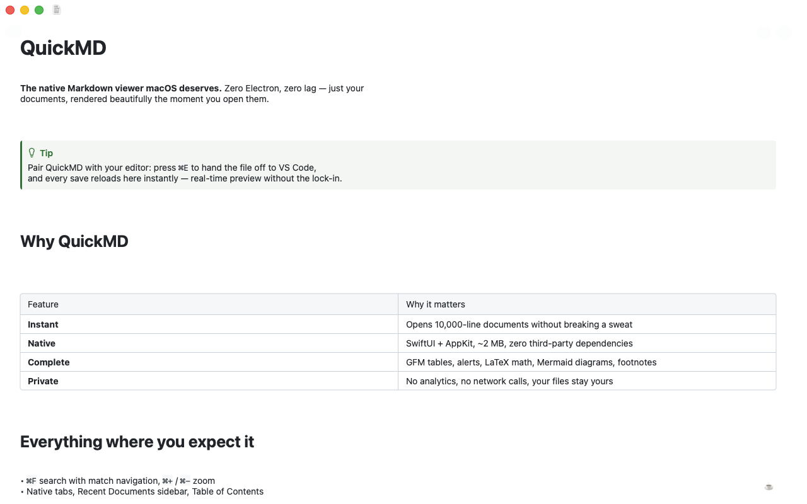
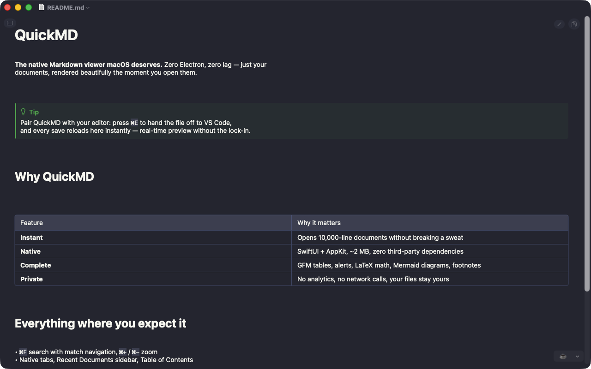
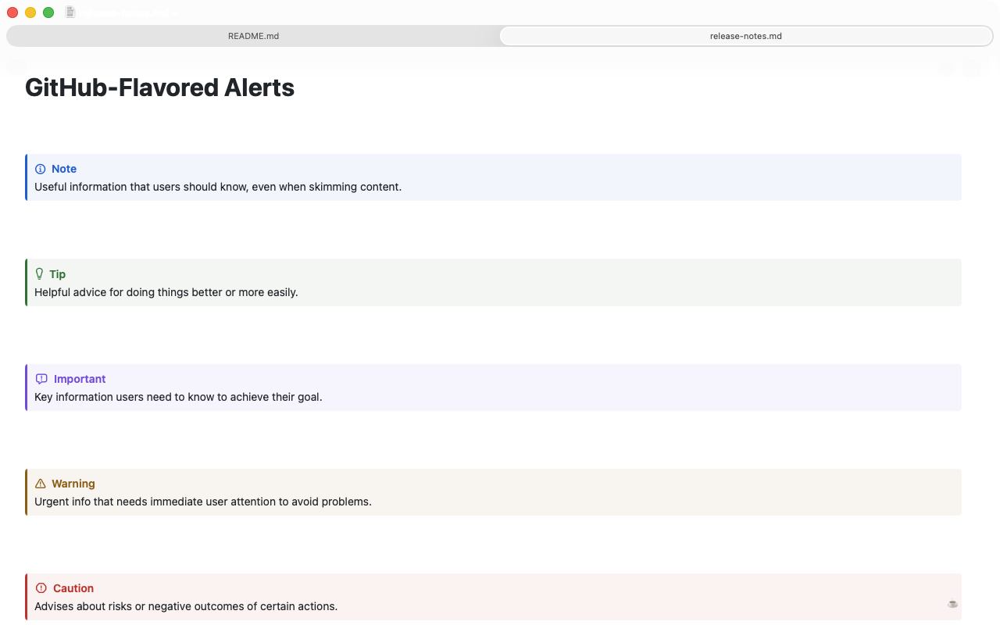
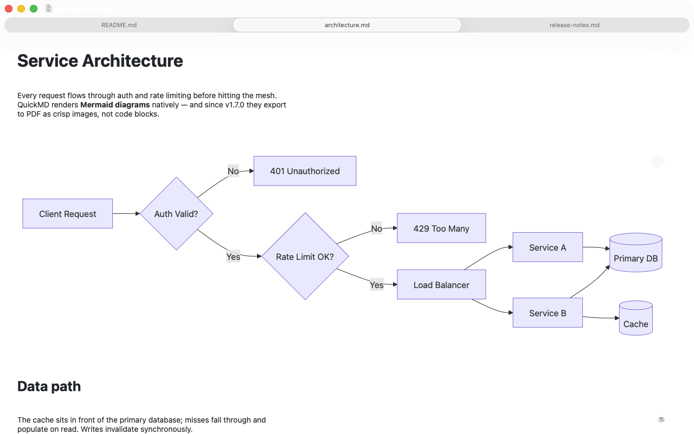
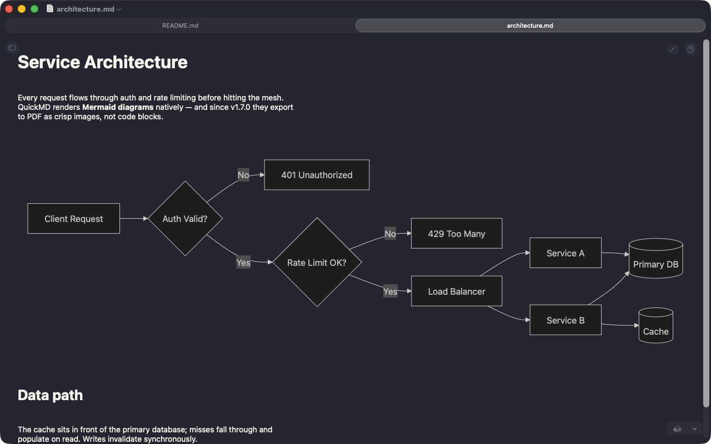
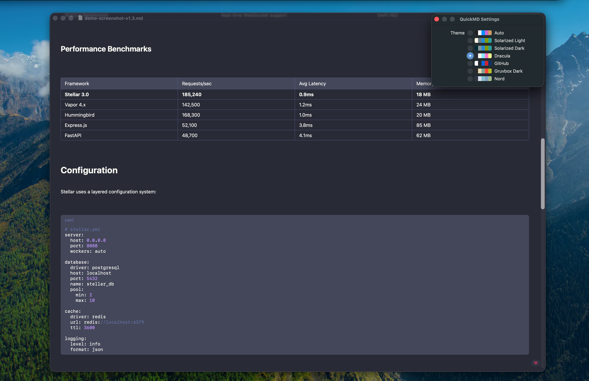
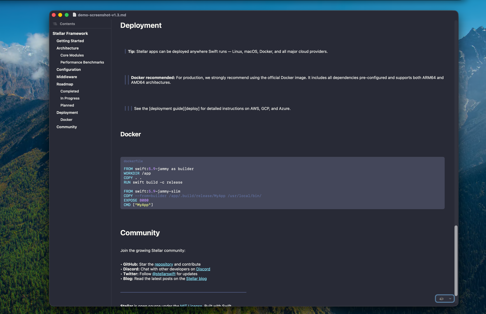

# QuickMD

<div align="center">

**Lightning-fast native macOS Markdown viewer**

[](https://www.apple.com/macos)
[](https://swift.org)
[](https://github.com/b451c/quickmd/actions/workflows/build.yml)
[](LICENSE)

[Features](#features) • [Installation](#installation) • [Usage](#usage) • [Under the Hood](#under-the-hood) • [Support](#support)

[](https://qmd.app/#support-goal)

**QuickMD needs its Apple Developer membership renewed ($99 a year, due 6 October 2026) to stay on the Mac App Store and keep every release notarized. [Chip in on Buy Me a Coffee or Ko-fi](#support-development).**

</div>

---

## Overview

**QuickMD** is a fast, elegant, fully native Markdown viewer for macOS. Double-click any `.md` file and instantly see beautifully rendered content. No Electron bloat, no loading screens—just pure native macOS performance.

Perfect for developers, writers, students, and anyone who works with Markdown daily. Think of it as the **Preview.app equivalent for Markdown files**.

## Features

### Blazing Fast
- Opens in milliseconds—no loading screens
- Native SwiftUI + AppKit app—lightweight, zero dependencies
- Huge documents (10,000+ lines) open and scroll smoothly, Table of Contents and search jumps land exactly, and QuickMD keeps your place through zoom, theme changes, resizes and auto-reload

### Fix It in Place
- **Source Edit (`⌥⌘E`)** — switch the window to the raw Markdown at the line you are reading, fix it, `⌘S`, `Esc`, and you are back in the rendered view at the same place. Select a word first and it is already selected in the source
- **Byte-faithful saves** — the file keeps its encoding (UTF-8, UTF-8 with BOM, UTF-16, Latin-1), line endings, permissions, Finder tags and symlinks; only what you typed changes
- **Nothing lost, nothing overwritten** — closing a tab, a window or the app with unsaved text always asks; if another app changes the file while you edit, QuickMD offers both versions instead of picking one
- **A real text editor underneath** — undo, system find and replace, indentation that follows the line, a light syntax tint from the same parser that renders the document
- Still a viewer first: no WYSIWYG, no split panes

### Works with Your Editor
- **Auto-reload** — the document refreshes the moment another app saves it. Turn on auto-save in VS Code, Cursor or Zed, or let an AI agent write the file, and QuickMD is a live preview
- **Open in External Editor (`⌘E`)** — for longer writing sessions: hands the file to your editor (auto-detected, configurable in Settings). VS Code, BBEdit, TextMate and Nova open at the line you are reading

### Complete Markdown Support
- Headings (ATX `#` and setext), bold, italic, strikethrough, horizontal rules
- Lists — nested, ordered, task lists (`- [ ]` / `- [x]`), definition lists (`Term` + `: definition`)
- Tables with column alignment (headerless `| | |` tables too)
- Code blocks with lightweight syntax highlighting (keywords, strings, comments, numbers, types) and a copy button
- **GitHub-flavored alerts** — `[!NOTE]`, `[!TIP]`, `[!IMPORTANT]`, `[!WARNING]`, `[!CAUTION]` as native callouts in GitHub's palette
- **LaTeX math** — display (`$$...$$`) and inline (`$...$`) with TeX-quality rendering
- **Mermaid diagrams** — flowcharts, sequence, pie, class diagrams and more; click any diagram or image for a window-filling preview with pinch-to-zoom
- **Inline SVG** — fenced ```svg blocks and `.svg` image links render natively (no web view), scale with the text and print as vectors
- Images — local files, remote URLs, embedded `data:` images, reference-style `![alt][ref]`, and HTML `` tags with `width` (the logo/screenshot idiom of GitHub READMEs, `<p align="center">` wrappers included)
- Links (inline, reference-style, autolinks), footnotes (`[^id]`), nested blockquotes
- YAML frontmatter (rendered as a neutral code block)
- CommonMark soft breaks; Windows (CRLF) and legacy line endings; UTF-16 and Latin-1 files

### Navigation & Search
- Zoom the whole document (`⌘+` / `⌘-` / `⌘0`) — per window, everything scales
- Find in document (`⌘F`) with match count and per-word navigation
- Word-level highlighting across all block types (text, code, tables, blockquotes)
- Table of Contents sidebar (`⌘⇧T`) — auto-generated from headings
- Reading mode (`⌘⇧R`) — hides both sidebars and the hover buttons and centres the text in a 720 pt column; `Esc` brings everything back
- **Select across the whole document** — drag through paragraphs, headings, lists, quotes, tables and code (it scrolls for you), Shift-click to extend, `⌘A` / `⌘C` to copy clean text (tables as tab-separated values, math as LaTeX). Every copy shows how many characters and words were copied; optional auto-copy of selections in Settings → General
- Copy entire document (`⌘⇧C`) or individual sections (hover heading → copy icon)
- Export to PDF (`⌘⇧E`) — **vector text** (selectable, searchable) with **rendered Mermaid diagrams** — and Print (`⌘P`)

### Custom Themes & Fonts
- 7 built-in themes: Auto, Solarized Light/Dark, Dracula, GitHub, Gruvbox Dark, Nord
- **User themes from disk** — drop a JSON file into `~/Library/Application Support/QuickMD/Themes/` (GitHub and Homebrew builds; the Mac App Store build keeps the same folder inside its container, `~/Library/Containers/pl.falami.studio.QuickMD/Data/`), or use the **Import Theme…** button in Settings. Live reload, no restart. See [docs/themes/](docs/themes/) for the schema and examples.
- **Custom font families** — pick any installed font for body text and another for code in Settings → Fonts (JetBrains Mono for code, a serif for reading…). Applies to the document, print and PDF; size and zoom are unaffected. Themes can set their own with `bodyFontFamily` / `codeFontFamily`.
- Settings panel (`⌘,`) with color and font previews
- Dark mode follows the system, or pick a fixed theme; theme and fonts persist across restarts

### Privacy Focused
- No analytics, no tracking
- Works completely offline (except for remote images)
- Your files stay on your device
- Open source—see exactly what the code does

## Screenshots

<div align="center">
<table>
<tr>
<td></td>
<td></td>
</tr>
<tr>
<td align="center"><em>Light Mode (GitHub theme)</em></td>
<td align="center"><em>Dark Mode (Dracula theme)</em></td>
</tr>
<tr>
<td></td>
<td></td>
</tr>
<tr>
<td align="center"><em>GitHub-flavored alerts</em></td>
<td align="center"><em>Mermaid diagrams, rendered natively</em></td>
</tr>
</table>
</div>

<details>
<summary><strong>More screenshots</strong></summary>

| Diagrams in Dark Mode | Theme Picker | Table of Contents |
|:-:|:-:|:-:|
|  |  |  |

</details>

## Installation

### Homebrew (Recommended)

```bash
brew tap b451c/quickmd
brew install --cask quickmd
```

### Direct Download

Download the latest notarized `QuickMD-vX.Y.Z.zip` from [GitHub Releases](https://github.com/b451c/quickmd/releases/latest), unzip, and move QuickMD to Applications.

### Mac App Store

The [Mac App Store version](https://apps.apple.com/app/quickmd/id6757681819) is unavailable from 6 October 2026 until the Apple Developer membership is renewed. The GitHub and Homebrew versions are the same app and keep receiving updates.

### Build from Source

Requires macOS 13.0 (Ventura) or later and Xcode 15+. See [Development](#development).

## Usage

### Set as Default Markdown Viewer

1. Right-click any `.md` file in Finder
2. Select **Get Info** (⌘I)
3. Under **Open with**, select **QuickMD**
4. Click **Change All...**

Now all your Markdown files will open instantly with QuickMD!

### Keyboard Shortcuts

| Shortcut | Action |
|----------|--------|
| `⌘O` | Open file |
| `⌘W` | Close tab (or window if last tab) |
| `⌥⌘E` | Edit the Markdown source in place / done editing |
| `⌘S` | Save (while editing the source) |
| `⌘E` | Open in External Editor (at the line you are reading, where supported) |
| `⌘F` | Find in document |
| `⌘G` / `⇧⌘G` | Next / previous match |
| `⌘A` / `⌘C` | Select the whole document / copy the selection |
| `⌘⇧C` | Copy Markdown source |
| `⌘⇧T` | Toggle Table of Contents |
| `⌘⇧D` | Toggle Recent Documents sidebar |
| `⌘⇧R` | Reading mode (distraction-free) |
| `⌃⇥` / `⌃⇧⇥` | Switch between tabs |
| `⌘⇧E` | Export to PDF |
| `⌘P` | Print |
| `⌘,` | Settings (themes, fonts, external editor) |
| `⌘+` / `⌘-` / `⌘0` | Zoom in / out / actual size |

## Under the Hood

- Swift 5.9, SwiftUI + AppKit, macOS 13.0+, Apple Silicon and Intel. Zero package dependencies: math rendering is vendored ([SwiftMath](https://github.com/mgriebling/SwiftMath)), [Mermaid.js](https://mermaid.js.org/) is bundled and runs offline
- Its own Markdown parser (block-level, with a YAML frontmatter and reference-link pre-pass) and a single inline scanner shared by parser and renderer
- Text is drawn by native `NSTextView`s hosted in a virtualized `NSTableView`; row heights are measured exactly, off the main thread, so scrolling and jumps stay exact on documents of any size
- A per-document file watcher (`DispatchSource`) drives auto-reload, including editors that save atomically
- One image loader and cache for local, remote and embedded images, on screen and in PDF
- Per-block **vector PDF export** — selectable text, embedded fonts, Mermaid diagrams as images, multi-page pagination
- Source Edit writes the file in place (inode, permissions and extended attributes survive) and re-encodes exactly what it decoded; the unsaved-changes guard sits in front of the window's own delegate, so the system's document machinery is untouched
- The Mac App Store build runs in the App Sandbox (security-scoped bookmarks for local images); the GitHub and Homebrew build is Developer ID signed and notarized, not sandboxed
- 688 unit tests; GitHub Actions builds every flavor on each push

### Where Things Live

```
QuickMD/
├── QuickMD/                    # App sources
│   ├── MarkdownBlockParser, MarkdownRenderer, InlineSyntaxScanner   # parsing and inline rendering
│   ├── MarkdownView, Views/VirtualBlockList                         # document window and the virtualized list
│   ├── Views/                                                       # block views, sidebars, settings, hover buttons
│   ├── SourceEdit*, DocumentFile*, EditCloseGuard                   # Source Edit (session, editor, file format, close guard)
│   ├── MarkdownExport, ImageLoader, FileWatchManager, ...           # PDF/print, images, auto-reload
│   ├── SwiftMath/                                                   # vendored math rendering
│   └── Resources/                                                   # bundled Mermaid.js + template
├── QuickMDTests/               # Unit tests
├── docs/themes/                # Custom theme schema + starter themes
└── CHANGELOG.md                # Version history
```

## Development

```bash
git clone https://github.com/b451c/quickmd.git
open quickmd/QuickMD/QuickMD.xcodeproj   # then ⌘R
```

### Building for Release

**GitHub version** (default — donation links, no Tip Jar):

```bash
xcodebuild -project QuickMD/QuickMD.xcodeproj -scheme QuickMD -configuration Release archive
```

Or simply build in Xcode with `⌘B`.

**App Store version** (Tip Jar IAP):

```bash
xcodebuild -project QuickMD/QuickMD.xcodeproj -scheme QuickMD -configuration Release \
  OTHER_SWIFT_FLAGS="-DAPPSTORE" archive
```

The `APPSTORE` flag enables Tip Jar IAP and disables the GitHub-only update checker.

### Running Tests

```bash
xcodebuild -project QuickMD/QuickMD.xcodeproj -scheme QuickMD \
  -destination 'platform=macOS' test
```

CI runs the test suite plus Release builds of both flavors on every push and pull request.

## Support

### Get Help

- [Report a Bug](https://github.com/b451c/quickmd/issues)
- [Request a Feature](https://github.com/b451c/quickmd/issues)

### Support Development

QuickMD is **free and open source**. If you find it useful, consider supporting development.

**Help bring QuickMD back to the Mac App Store:** the Apple Developer Program membership ($99 a year) expires on 6 October 2026. Donations go to renewing it - [see the goal on qmd.app](https://qmd.app/#support-goal).

[](https://qmd.app/#support-goal)


<a href="https://buymeacoffee.com/bsroczynskh" target="_blank"></a>
<a href="https://ko-fi.com/quickmd" target="_blank"></a>

## Roadmap

What has shipped, release by release, is in the [CHANGELOG](QuickMD/CHANGELOG.md). What comes next is shaped by [issues](https://github.com/b451c/quickmd/issues) — if something is missing for you, open one.

## Contributing

Contributions are welcome! Please feel free to submit a Pull Request. Everyone who has contributed code or a report is credited in the [CHANGELOG](QuickMD/CHANGELOG.md).

1. Fork the repository
2. Create your feature branch (`git checkout -b feature/amazing-feature`)
3. Commit your changes (`git commit -m 'Add amazing feature'`)
4. Push to the branch (`git push origin feature/amazing-feature`)
5. Open a Pull Request

## License

This project is licensed under the **MIT License** - see the [LICENSE](LICENSE) file for details.

## Privacy

QuickMD respects your privacy. See our [Privacy Policy](PRIVACY.md) for details.

**TL;DR:** No data collection, no analytics, no tracking. Everything runs locally on your device.

---

<div align="center">

**Built with Swift and SwiftUI. No dependencies, no compromises.**

If QuickMD is useful to you, a star helps others find it.

</div>
