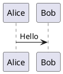

# Offline diagrams

QuickMD recognizes fenced `mermaid`, `bpmn`, `plantuml` (`puml` is an alias),
and `svg` blocks. Fence names are case-insensitive; backticks and tildes work.
Linked `.bpmn`, `.puml`, `.plantuml`, and `.svg` files also use the vector viewer
through Markdown image syntax:

```markdown


```

Relative paths resolve from the Markdown document’s folder; absolute paths,
file URLs, and HTTP(S) URLs are also supported. Linked sources must be UTF-8
and no larger than 2 MB. Ordinary links without `!` remain clickable links.

For example:

````markdown

````

Open [the complete sample](../QuickMD/test-diagrams.md) to compare every format,
including fenced and linked BPMN, PlantUML, and SVG diagrams.

Graphics scale with text from their fitted 100% size, preserving aspect ratio
and staying within the column. Click a graphic to open the window-filling
preview. The preview has zoom controls, pinch zoom, and Escape/Done dismissal.
SVG originals are cached by language, source, and theme, so resizing does not
rerun the diagram engines. PDF export and print render fenced diagrams from
the same SVG output, with a source-code fallback if rendering fails.

## Input requirements

- **BPMN:** provide BPMN 2.0 XML including BPMN Diagram Interchange (DI) positions
  and edges. A process definition without diagram layout is not sufficient.
  The bpmn.io artwork is preserved below the process, and a bpmn.io link remains
  visible. BPMN uses a white canvas to keep labels readable in dark themes.
- **PlantUML:** the browser engine supports ordinary sequence, class, activity,
  and other PlantUML diagrams. Remote includes and external image assets are
  unavailable. The optional large sprite/stdlib packs are not bundled; documents
  depending on those packs need a self-contained source or an exported SVG.
  Some invalid PlantUML inputs produce an SVG showing the engine's syntax error.
- **SVG:** use self-contained UTF-8 SVG, preferably with a `viewBox`. Scripts and
  external subresources are disabled in SVG image mode. Linked remote `.svg`
  files are downloaded like other remote Markdown images, but their nested
  resources are not fetched.
- Rendering accepts source up to 2 MB and has a timeout. Failures are shown in
  the document and do not stop subsequent diagrams from rendering.

## Bundled libraries

- Existing Mermaid bundle.
- `bpmn-js` 18.28.0, bpmn.io license (including visible attribution requirement).
- `@plantuml/core` 1.2026.8, the official MIT browser build. Its bundled Viz.js
  3.24.0 contains Graphviz 14.1.1 and Expat 2.7.3. Their license texts are included.

Runtime rendering uses Apple's WebKit. It needs neither Node.js, Java, nor an
external rendering service. The added vendor files occupy approximately 13 MB
uncompressed. Node/npm are used only when rebuilding the checked-in bundles:

```sh
npm ci --ignore-scripts --prefix scripts/diagram-vendors
npm run vendor --prefix scripts/diagram-vendors
```

`package-lock.json` pins the inputs. `Resources/Diagrams/vendor/manifest.json`
records the generated asset hashes. PlantUML is converted from an ES module to
a classic script for WebKit's local-file loading. It is deliberately not
minified: minification produced an invalid JavaScript label in WebKit.

Run the focused browser-engine checks with:

```sh
scripts/check-diagrams.sh
```

The renderer page uses CSP to block network requests. Source reaches it through
structured JavaScript arguments. Display uses a separate, JavaScript-disabled
WebView containing an SVG image data URL, rather than inserting source SVG as
active page markup. Tests exercise the actual bundled engines, cache reuse,
request serialization, error recovery, sizing, image isolation, and PDF output.

Upstream sources: [bpmn-js](https://github.com/bpmn-io/bpmn-js),
[PlantUML MIT browser package](https://github.com/plantuml/plantuml/blob/master/PUBLISHING_NPM.md),
[Viz.js](https://github.com/mdaines/viz-js/tree/v3),
[Graphviz 14.1.1](https://gitlab.com/graphviz/graphviz/-/tree/14.1.1),
[Expat 2.7.3](https://github.com/libexpat/libexpat/tree/R_2_7_3).
